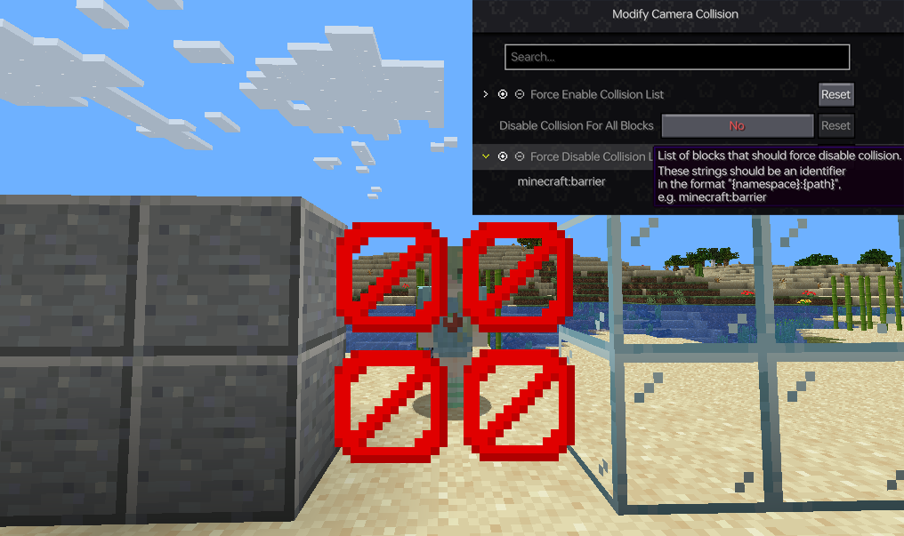
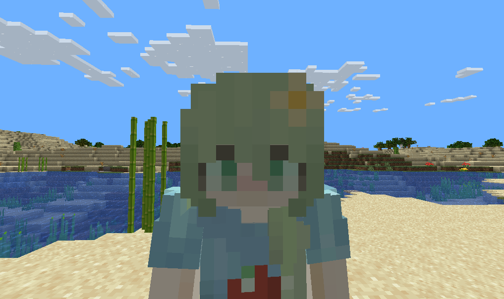

Change how your camera collision works in third-person view!

改变你第三人称的视角碰撞！

Have you ever wondered why the Glass won't squeeze your F5 view while the Barrier does?

你有没有感到奇怪为什么玻璃不会挤压你的F5视角，而屏障可以？

This mod allows you to customize what blocks should squeeze your camera and what blocks shouldn't.

这个模组可以让你自定义什么方块应该挤压你的视角，而什么方块不应该。

This mod has been tested on [1.17.1], [1.18.2], [1.19], [1.19.4], [1.20], [1.20.1].

这个模组在以下版本测试可以运行：[1.17.1], [1.18.2], [1.19], [1.19.4], [1.20], [1.20.1]

| with this mod          | without this mod           |
|------------------------|----------------------------|
|  |  |
